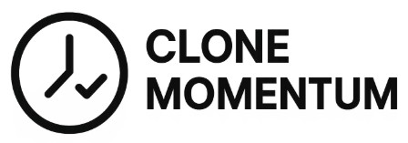

<!-- BANNER -->
<p align="center">
  
</p>

<h1 align="center">🌿 Momentum Clone</h1>
<p align="center">
  <b>Next.js와 Tailwind CSS를 이용한 Momentum 클론코딩 프로젝트</b>
</p>

<!-- BADGES -->
<p align="center">
  
  
  
  
  
  
</p>

---

## 🌈 주요 기능
- ⏰ 화면 중앙에 **실시간 시계** 표시  
- 📝 **오늘의 할 일(To-do)** 입력 및 저장 기능  
- 🖼️ **배경 랜덤 이미지** (예: Unsplash API 연동)  
- 💡 **오늘의 명언** 랜덤 표시  
- 💾 **로컬 스토리지 저장**으로 새로고침 후에도 데이터 유지  

---

## 🛠 기술 스택
<p align="center">
  
  
  
  
  
  
</p>

---

## 📦 설치 및 실행
```bash
# 1) 레포지토리 복제
git clone https://github.com/choidy180/next-v13-moment
cd momentum-clone

# 2) 의존성 설치
npm install

# 3) 개발 서버 실행
npm run dev
# 브라우저에서 http://localhost:3000 접속
